# SugarSphere - Sweet Shop Management System

A full-stack e-commerce platform for selling traditional Indian sweets with JWT authentication, Razorpay payments, real-time notifications, and comprehensive admin dashboard.

## � Demo Video

[](https://www.youtube.com/watch?v=YOUR_VIDEO_ID)

> 📺 Click the image above to watch the full project demo on YouTube

## �� Features

### Customer Features

- **Browse & Search**: Explore sweets by category, price range, and search
- **User Authentication**: Secure JWT-based login with refresh tokens
- **Shopping Cart**: Add, remove, and manage items in cart
- **Secure Payments**: Integrated Razorpay payment gateway
- **Order Tracking**: Track order status in real-time
- **Notifications**: Real-time notifications via Socket.IO
- **Profile Management**: Update profile and change password

### Admin Features

- **Dashboard**: Overview of sales, orders, and user statistics
- **Products Management**: CRUD operations for sweets with image upload
- **Orders Management**: Update order status and track deliveries
- **Users Management**: View and manage user roles and status
- **Analytics**: Revenue reports and top-selling products

## 📸 Screenshots

### Authentication

|             L ogin              |               R egister               |
| :-----------------------------: | :-----------------------------------: |
| 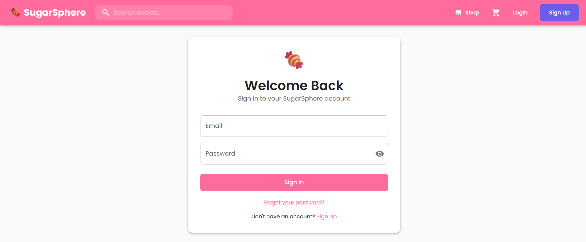 | 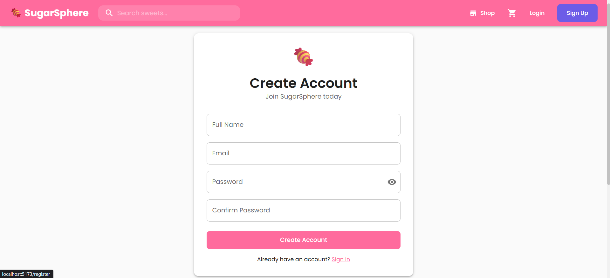 |

|                    E mail Verification                    |                  F orgot Password                   |
| :-------------------------------------------------------: | :-------------------------------------------------: |
| 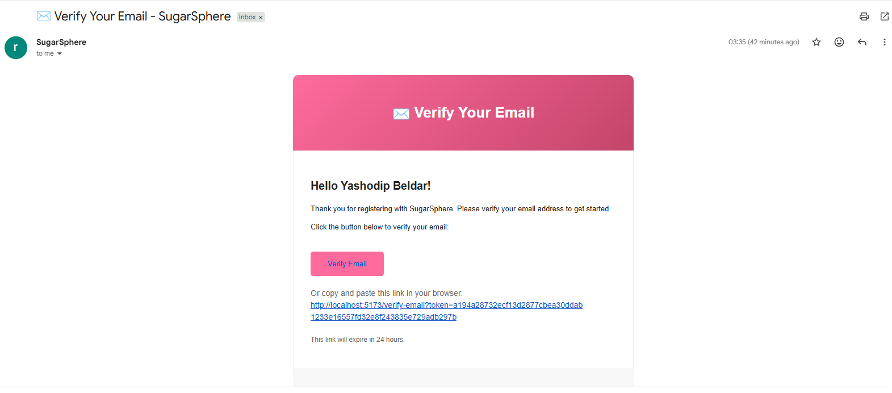 | 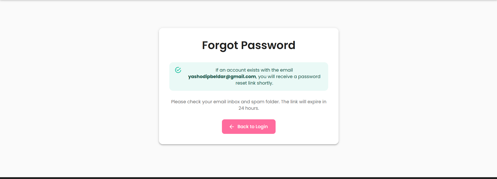 |

### Customer Pages

|       Home / Dashboard        |              S weets Explore              |
| :---------------------------: | :---------------------------------------: |
| 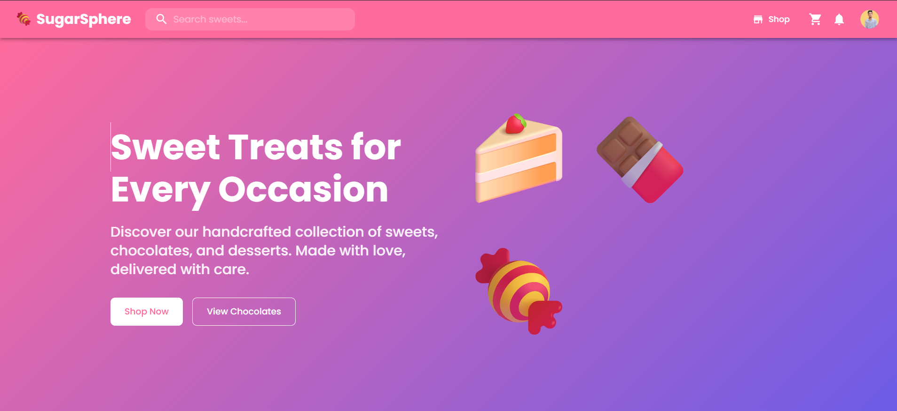 | 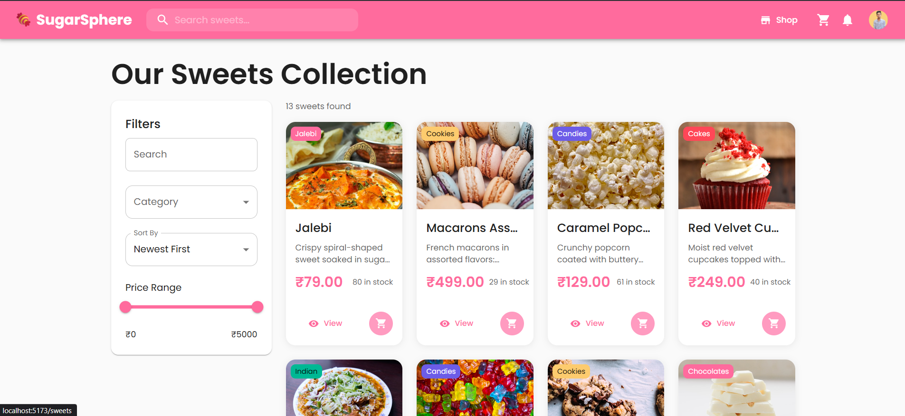 |

|                 S weet Detail                 |        S hopping Cart         |
| :-------------------------------------------: | :---------------------------: |
| 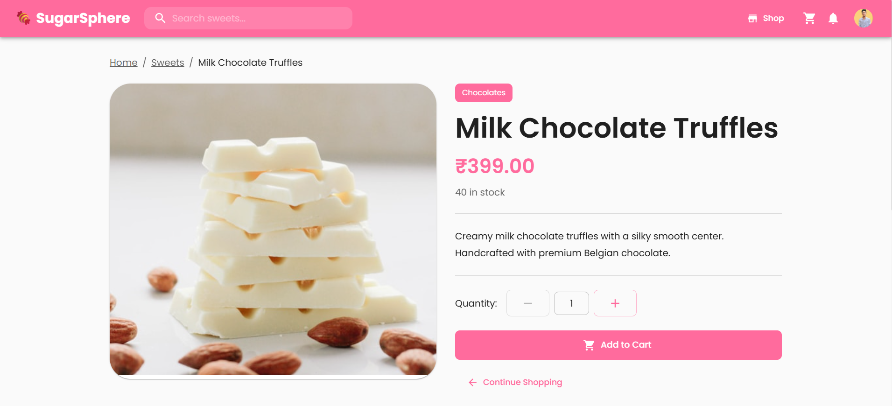 | 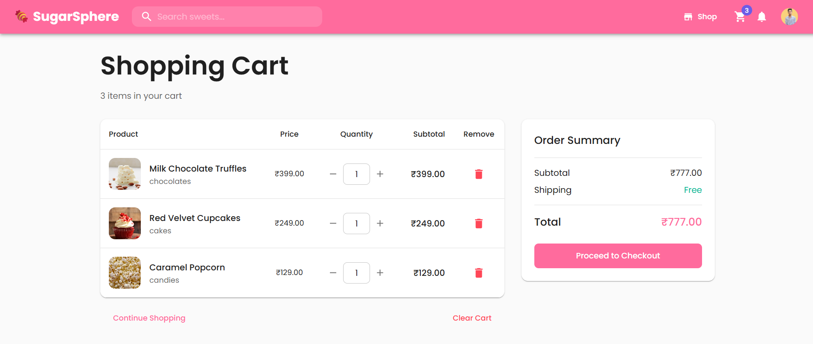 |

|               Razorpay Payment               |                 O rder Confirmation                  |
| :------------------------------------------: | :--------------------------------------------------: |
| 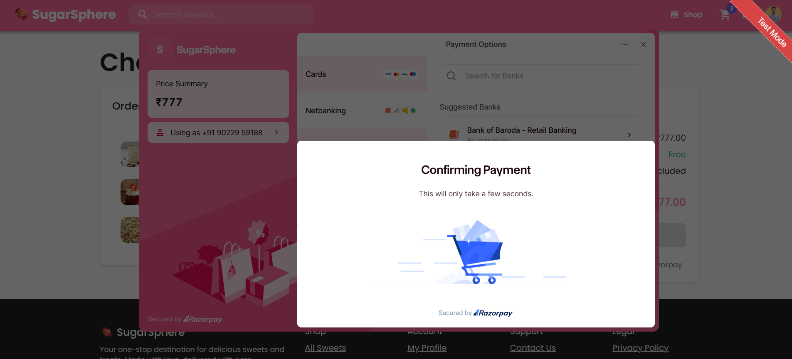 | 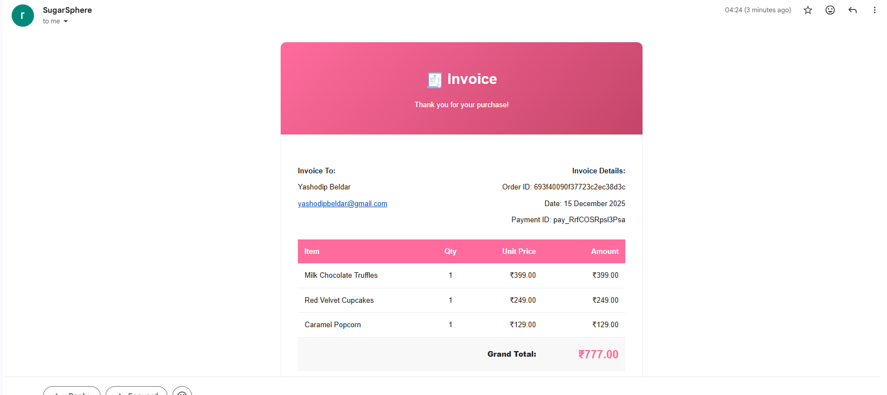 |

|              M y Orders              |            O rder Details & Reviews             |
| :----------------------------------: | :---------------------------------------------: |
| 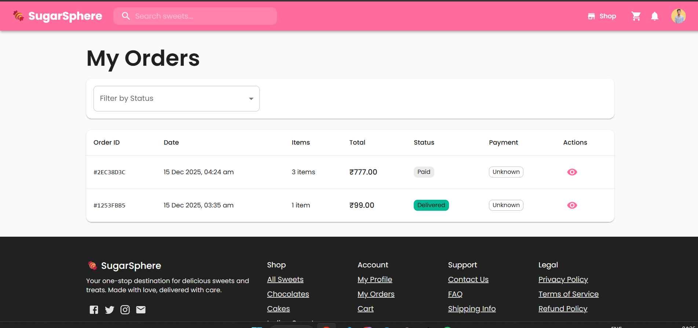 | 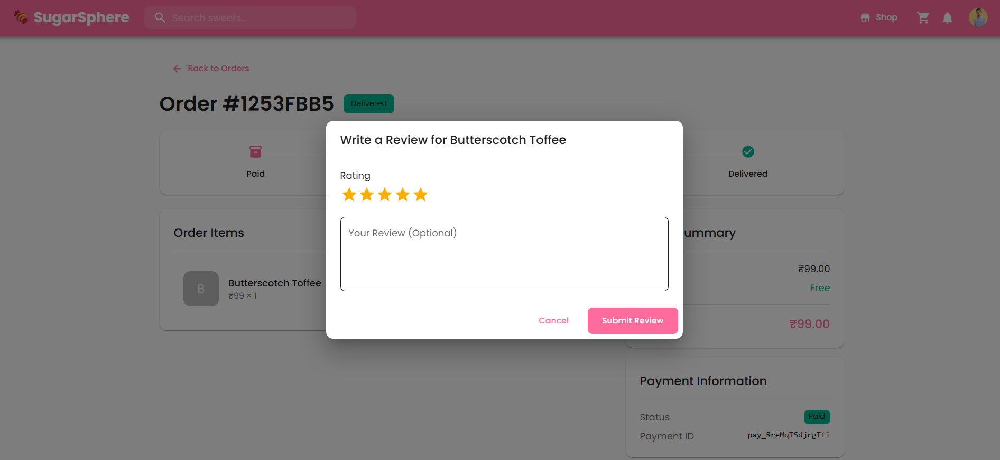 |

### Admin Panel

|                  A dmin Dashboard                   |                  A nalytics                   |
| :-------------------------------------------------: | :-------------------------------------------: |
|  | 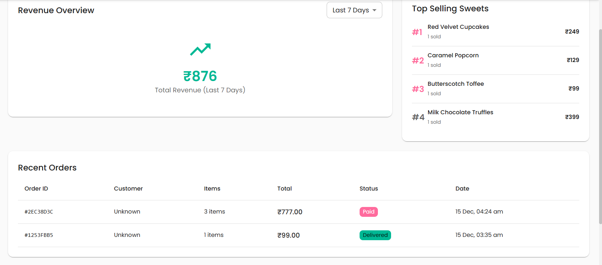 |

|               Product Management                |              A dd/Edit Product              |
| :---------------------------------------------: | :-----------------------------------------: |
|  |  |

|                 Order Management                  |             U ser Management              |
| :-----------------------------------------------: | :---------------------------------------: |
| 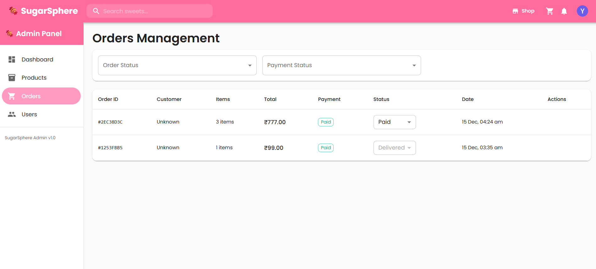 | 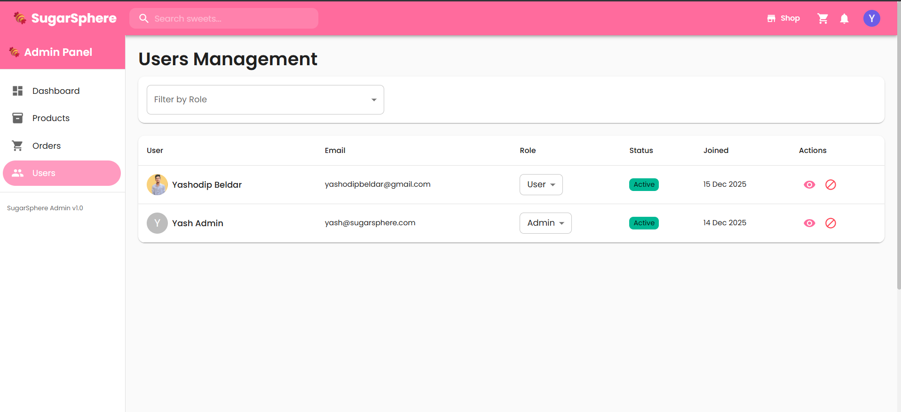 |

### Profile & Settings

|                 Profile                  |           Change Password            |
| :--------------------------------------: | :----------------------------------: |
| 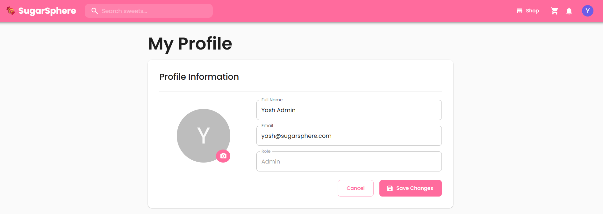 |  |

## 🛠️ Tech Stack

### Backend

- **Runtime**: Node.js with Express.js
- **Language**: TypeScript
- **Database**: MongoDB with Mongoose ODM
- **Authentication**: JWT (Access + Refresh tokens)
- **File Upload**: Cloudinary for media storage
- **Payments**: Razorpay integration
- **Real-time**: Socket.IO
- **Email**: Nodemailer
- **Job Queue**: BullMQ with Redis
- **Validation**: Zod

### Frontend

- **Framework**: React 18 with Vite
- **Language**: TypeScript
- **UI Library**: Material UI (MUI)
- **State Management**: Zustand
- **Server State**: TanStack React Query
- **Forms**: React Hook Form + Zod
- **HTTP Client**: Axios with interceptors
- **Routing**: React Router v6
- **Notifications**: react-hot-toast

## 📦 Project Structure

```
SweetSellingPlatform/
├── backend/
│   ├── src/
│   │   ├── config/         # Configuration files
│   │   ├── middleware/     # Express middleware
│   │   ├── models/         # Mongoose models
│   │   ├── routes/         # API routes
│   │   ├── services/       # Business logic services
│   │   ├── sockets/        # Socket.IO setup
│   │   ├── queues/         # BullMQ job queues
│   │   └── utils/          # Utility functions
│   ├── Dockerfile
│   └── package.json
├── frontend/
│   ├── src/
│   │   ├── api/            # API client and endpoints
│   │   ├── components/     # Reusable components
│   │   ├── hooks/          # Custom React hooks
│   │   ├── pages/          # Page components
│   │   ├── store/          # Zustand stores
│   │   └── types/          # TypeScript types
│   ├── Dockerfile
│   ├── nginx.conf
│   └── package.json
├── docker-compose.yml
└── README.md
```

## 🚀 Getting Started

### Prerequisites

- Node.js 18+
- MongoDB
- Redis
- Razorpay account
- Cloudinary account
- Gmail OAuth2 credentials

### Local Development

1. **Clone the repository**

   ```bash
   git clone https://github.com/Mr-Yash-beldar/SugarSphere
   cd SugarSphere
   ```

2. **Backend Setup**

   ```bash
   cd backend
   npm install
   cp .env.example .env
   # Edit .env with your credentials
   npm run dev
   ```

3. **Frontend Setup**

   ```bash
   cd frontend
   npm install
   cp .env.example .env
   # Edit .env with your credentials
   npm run dev
   ```

4. **Access the application**
   - Frontend: http://localhost:5173
   - Backend API: http://localhost:5000

## 📡 API Endpoints

### Authentication

- `POST /api/auth/register` - Register new user
- `POST /api/auth/login` - Login user
- `POST /api/auth/refresh` - Refresh access token
- `POST /api/auth/logout` - Logout user

### Sweets

- `GET /api/sweets` - Get all sweets (with filters)
- `GET /api/sweets/:id` - Get sweet by ID
- `POST /api/sweets` - Create sweet (Admin)
- `PUT /api/sweets/:id` - Update sweet (Admin)
- `DELETE /api/sweets/:id` - Delete sweet (Admin)

### Orders

- `GET /api/orders` - Get all orders (Admin)
- `GET /api/orders/my` - Get user's orders
- `GET /api/orders/:id` - Get order by ID
- `POST /api/orders` - Create order
- `POST /api/orders/:id/verify` - Verify payment
- `PATCH /api/orders/:id/status` - Update status (Admin)
- `POST /api/orders/:id/cancel` - Cancel order

### Users

- `GET /api/users` - Get all users (Admin)
- `GET /api/users/profile` - Get current user profile
- `PUT /api/users/profile` - Update profile
- `PUT /api/users/password` - Change password
- `PATCH /api/users/:id/role` - Update user role (Admin)
- `PATCH /api/users/:id/status` - Toggle user status (Admin)

### Notifications

- `GET /api/notifications` - Get user notifications
- `PATCH /api/notifications/:id/read` - Mark as read
- `PATCH /api/notifications/read-all` - Mark all as read
- `DELETE /api/notifications/:id` - Delete notification

### Analytics (Admin)

- `GET /api/analytics/stats` - Get dashboard stats
- `GET /api/analytics/revenue` - Get revenue data
- `GET /api/analytics/top-sweets` - Get top selling sweets
- `GET /api/analytics/recent-orders` - Get recent orders

## 🔐 Environment Variables

### Backend (.env)

```
PORT=5000
NODE_ENV=development
MONGODB_URI=mongodb://localhost:27017/sugarsphere
REDIS_HOST=localhost
REDIS_PORT=6379

JWT_SECRET=your-jwt-secret
JWT_REFRESH_SECRET=your-refresh-secret
JWT_ACCESS_EXPIRES_IN=15m
JWT_REFRESH_EXPIRES_IN=7d

RAZORPAY_KEY_ID=your-razorpay-key-id
RAZORPAY_KEY_SECRET=your-razorpay-key-secret

CLOUDINARY_CLOUD_NAME=your-cloud-name
CLOUDINARY_API_KEY=your-api-key
CLOUDINARY_API_SECRET=your-api-secret

GMAIL_USER=your-email@gmail.com
GMAIL_APP_PASSWORD=email_app_password

FRONTEND_URL=http://localhost:5173
```

### Frontend (.env)

```
VITE_API_URL=http://localhost:5000/api
VITE_SOCKET_URL=http://localhost:5000
VITE_RAZORPAY_KEY_ID=your-razorpay-key-id
```

## 🧪 Testing

This project follows **Test-Driven Development (TDD)** principles with the Red-Green-Refactor cycle.

### Running Tests

```bash
cd backend
npm test                 # Run all tests
npm run test:watch       # Watch mode
npm run test:coverage    # With coverage report
```

### Test Structure

```
backend/src/__tests__/
├── setup.ts                    # Test setup with MongoMemoryServer
├── models/
│   ├── user.test.ts            # User model tests
│   ├── sweet.test.ts           # Sweet model tests
│   └── order.test.ts           # Order model tests
├── routes/
│   ├── auth.test.ts            # Auth routes integration tests
│   └── sweets.test.ts          # Sweets routes integration tests
└── services/
    └── auth.service.test.ts    # Auth service unit tests
```

### Coverage Thresholds

- Branches: 70%
- Functions: 70%
- Lines: 70%
- Statements: 70%

## 🌱 Database Seeding

Seed the database with sample data for development:

```bash
cd backend
npm run seed
```

This will create:

- **Admin User**: yash@sugarsphere.com / yash123
- **10+ Sample Sweets**: Various categories (cakes, cookies, chocolates, candies, etc.)

> ⚠️ **Warning**: The seed script clears existing data before seeding!

## 🤖 AI Usage Documentation

This project was developed with assistance from AI tools as part of the development workflow.

### AI Tools Used

- **ChatGPT and Claude** - Primary AI assistant for code generation and problem-solving

### How AI Was Used

| Area                     | AI Contribution                                                                      |
| ------------------------ | ------------------------------------------------------------------------------------ | --- |
| **Project Structure**    | Initial project scaffolding, folder organization, and file structure recommendations |
| **API Design**           | RESTful endpoint design, request/response schemas, and error handling patterns       |     |
| **Razorpay Integration** | Payment gateway setup, order creation, and webhook verification                      |

| **Nodemailer Setup** Email service configuration, template design  
| **Redis/BullMQ** Job queue implementation for async email processing | |
| **Testing (TDD)** Jest configuration, test setup with MongoMemoryServer, and comprehensive test cases  
| \*_UI/UX Fixes_ Responsive design improvements, loading states, and component stylin

### AI Impact Reflection

**Benefits:**

- Accelerated development with boilerplate code generation
- Consistent code patterns across the codebase
- Quick debugging and problem identification
- Comprehensive test case generation following TDD principles
- Documentation and README generation

**Learnings:**

- AI works best when given clear, specific requirements
- Human review is essential for security-critical code
- AI suggestions need testing and validation
- Complex business logic requires human understanding

### Commit Message Convention

All commits include AI co-authorship attribution

## 🔧 Troubleshooting

### Common Issues

**Razorpay not working locally:**

- Ensure `RAZORPAY_KEY_ID` and `RAZORPAY_KEY_SECRET` are set
- Use test mode keys for development

**Redis connection failed:**

- Make sure Redis server is running: `redis-server`
- Check `REDIS_HOST` and `REDIS_PORT` in .env

**Email sending failed:**

- Enable "Less secure app access" or use App Password for Gmail
- Set `GMAIL_USER` and `GMAIL_APP_PASSWORD` correctl

## 📝 License

This project is licensed under the MIT License.

## 🤝 Contributing

Contributions are welcome! Please feel free to submit a Pull Request.
